```py
Nama  : Ridwan Abdulah
NIM   : 312110369
Kelas : T1.21.C5
```
# PERTEMUAN 12

Pada pertemuan 12 saya diberi soal sebagai berikut :
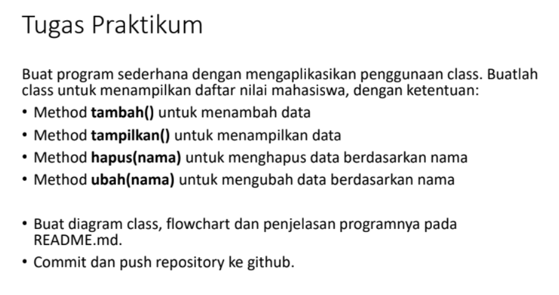

## DIAGRAM CLASS
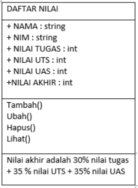

## FLOWCHART


## PROGRAM PERTEMUAN 12
Pertama saya akan membuat kelas mahasiswa sebagai berikut :
```py
class mahasiswa()
```
lalu saya akan melanjutkan dengan membuat method method fungsinya
```py
def tambah(self)
def ubah(self)
def lihat(self)
def hapus(self)
```
lalu saya mengisi setiap method dengan elemen elemennya
```py
nama       = str(input("masukan nama: "))
nim        = str(input("masukan nim :"))                                         
nilaiTugas = int(input("Masukkan Nilai Tugas: "))
nilaiUts   = int(input("Masukkan Nilai UTS\t: "))            
nilaiUas   = int(input("Masukkan Nilai UAS\t: "))             
nilaiAkhir = (0.30 * nilaiTugas) + (0.35 * nilaiUts) + (0.35 * nilaiUas)
dt[nama]   = nim,nilaiTugas,nilaiUts,nilaiUas,nilaiAkhir
```
Lalu saya membuat sebuah looping
```py
while True:
    input('tambah   (1)
           ubah     (2)
           lihat    (3)
           hapus    (4)
           ')
    c = input("\nsilahkan masukan pilihan : ")
```
Dan terakhir saya membuat fungsi IF ELSE untuk menjalankan method
```py
if (c=="1"):
    data.tambah()
elif (c=="2"):
    data.ubah()
elif (c=="3"):
    data.lihat()
elif (c=="4"):
    data.hapus()
else:
    data.keluar()
    break
```
# TAMPILAN VISUAL STUDIO CODE


# OUTPUT

Menambahkan data

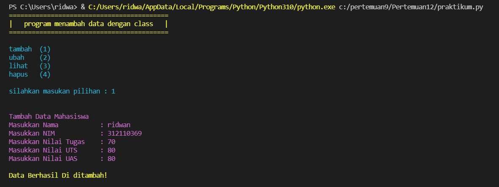

Melihat data

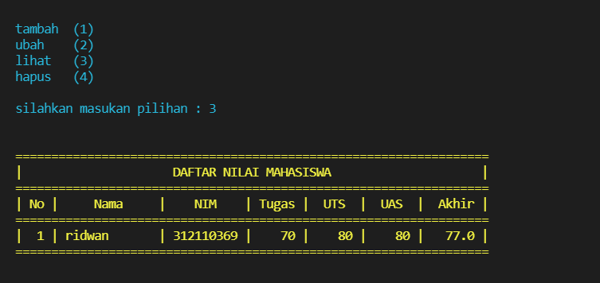

Menambah lagi

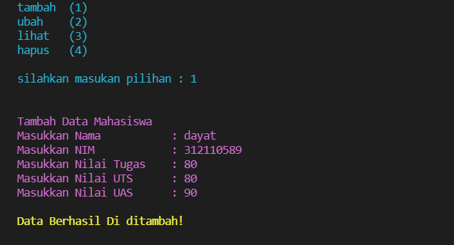

Melihat hasil

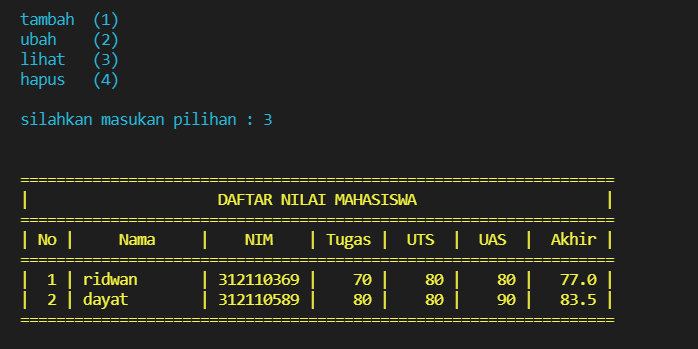

Mengubah data

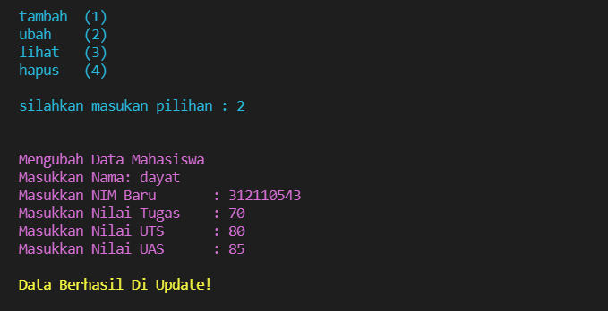

Melihat hasil data yang diubah

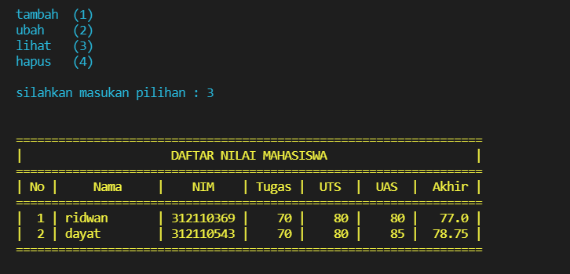

Menghapus data apabila memilih tidak

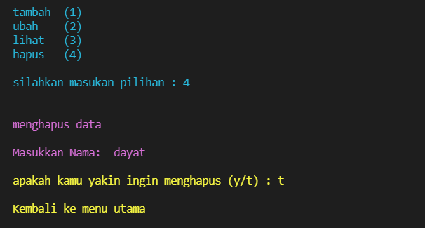

Menghapus data apabila memilih ya

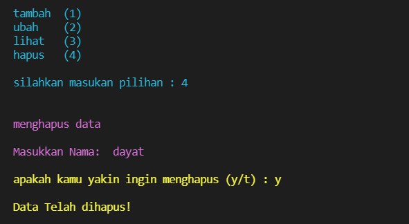

Menampilkan data yang belum dihapus dan yang sudah dihapus

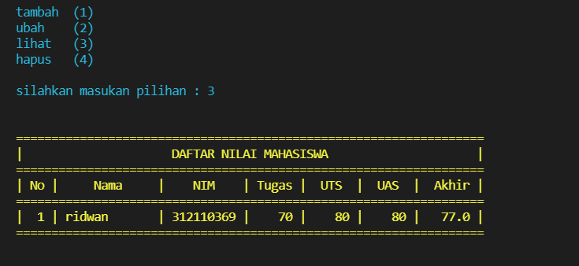

Apabila sudah silahkan ketik keluar atau pilihan yang lain

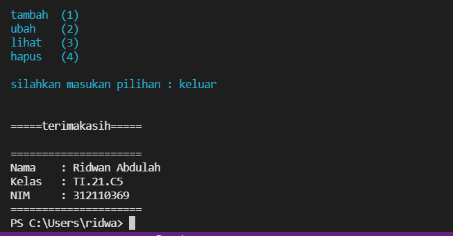

## TERIMAKASIH